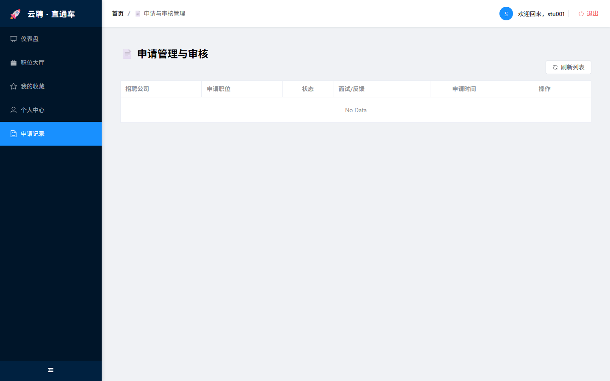
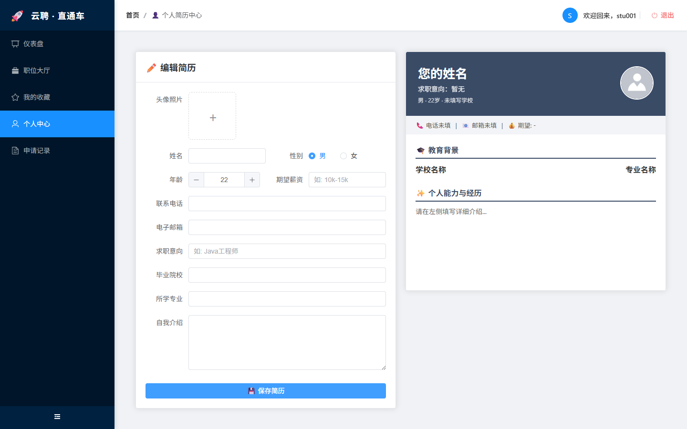

# MyJobSystem - 求职招聘管理系统


## 📖 项目介绍 | Introduction

这是一个基于 **Spring Boot** 和 **Vue 3** 开发的前后端分离的求职招聘系统。系统旨在为求职者和招聘企业提供一个高效的对接平台。

**主要功能模块：**
* **用户端**：职位浏览 (Job Hall)、简历投递、个人中心、登录注册。
* **企业端**：公司管理 (Company Management)、职位发布、申请处理。
* **管理端**：用户管理 (User Management)、系统审核。

## 🛠️ 技术栈 | Tech Stack

### 后端 (Backend)
* **开发语言**：Java (JDK 17+)
* **框架**：Spring Boot
* **ORM框架**：MyBatis (配合 Mapper XML)
* **数据库**：MySQL 8.0
* **构建工具**：Maven

### 前端 (Frontend)
* **框架**：Vue 3 (Composition API)
* **构建工具**：Vite
* **路由管理**：Vue Router
* **HTTP请求**：Axios (预计)
* **UI组件库**：Element Plus (待定)

## 📂 目录结构 | Directory Structure

```text
MyJobSystem/
├── employment-system-backend/   # Java 后端项目源码
│   ├── src/main/java/           # Controller, Service, Mapper 代码
│   └── src/main/resources/      # 配置文件和 Mapper XML
├── frontend/                    # Vue 前端项目源码
│   ├── src/views/               # 页面组件 (Login, Dashboard, JobHall)
│   └── src/components/          # 公共组件
├── .gitignore                   # Git 忽略配置
└── README.md                    # 项目说明文档

## 📸 项目截图 | Screenshots

### 登录界面


### 注册界面


### 职位大厅


### 申请



### 个人中心



### 主页


🚀 快速开始 | Quick Start
1. 后端启动 (Backend)
确保本地已安装 JDK 17+ 和 MySQL。

使用 IntelliJ IDEA 打开 employment-system-backend 目录。

配置数据库：

找到 src/main/resources/application.properties.example。

复制并重命名为 application.properties。

修改文件中的 url, username, password 为你本地的数据库配置。

等待 Maven 依赖下载完成。

运行 EmploymentSystemBackendApplication 主程序。

2. 前端启动 (Frontend)
请确保本地已安装 Node.js 环境。

Bash

# 进入前端目录
cd frontend

# 安装依赖
npm install

# 启动开发服务器
npm run dev
启动成功后，访问控制台输出的地址（通常是 http://localhost:5173）。

⚠️ 注意事项 | Notes
本项目为了保护隐私，已忽略上传 application.properties 文件。请务必按照上述步骤手动创建配置文件。

数据库 SQL 脚本尚未包含在本项目中（如有需要请联系作者）。
