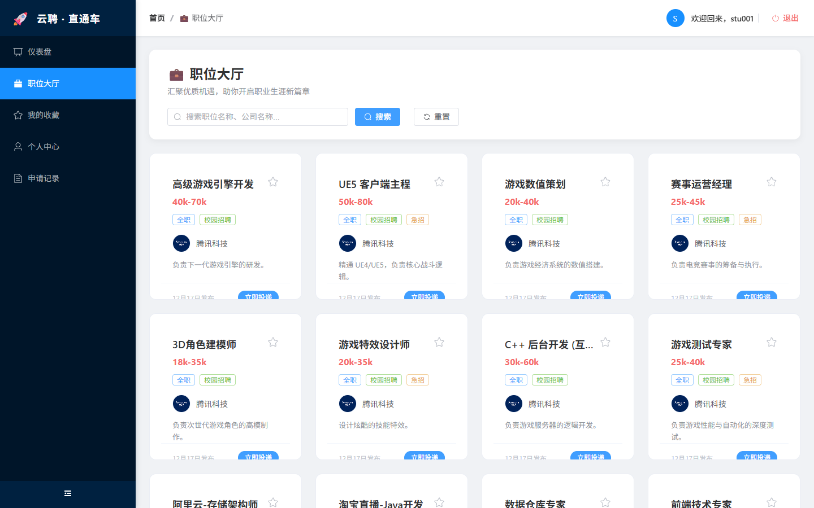
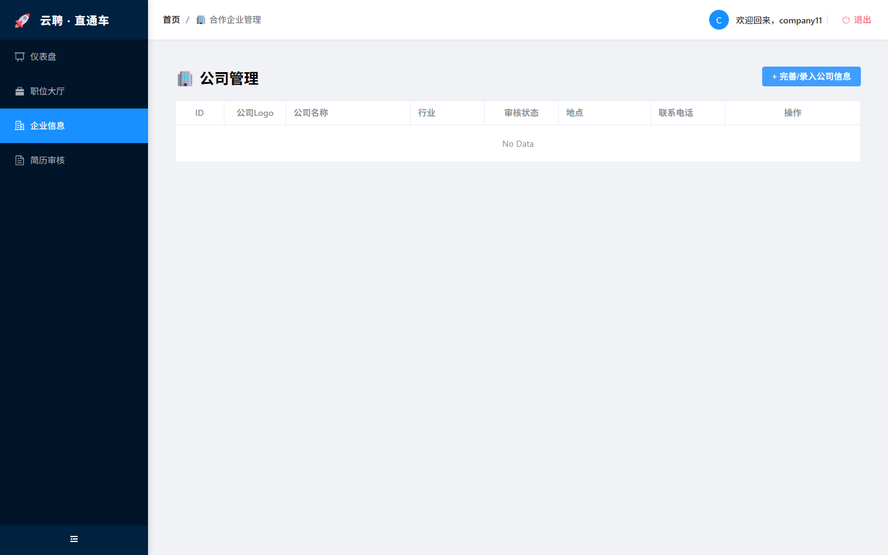
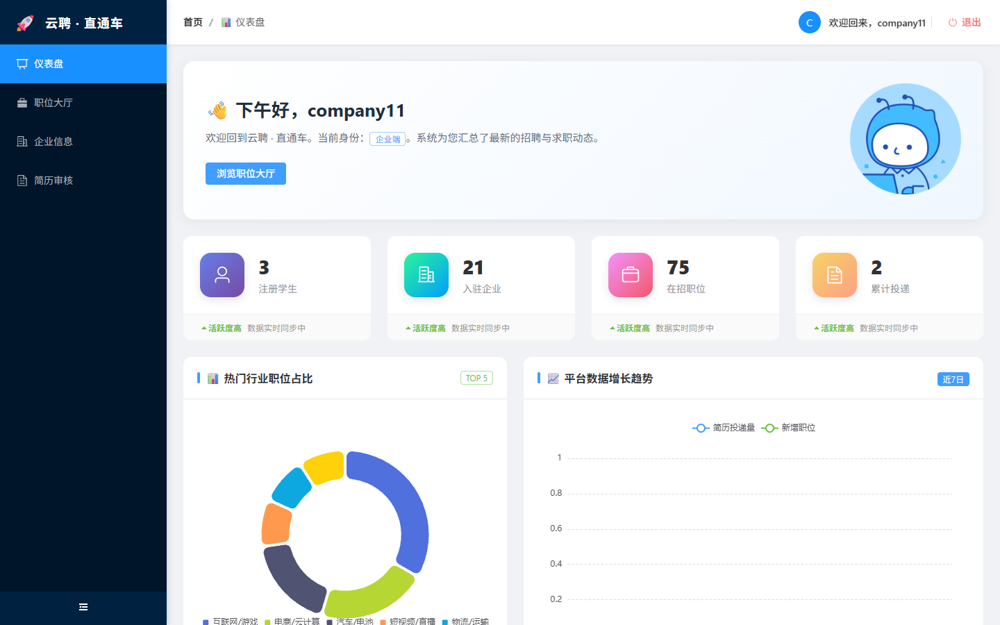

# 🚀 云聘 · 直通车 (YunPin) — 校园级全栈招聘管理平台

<div align="center">
  
  
  
  
  
</div>

<div align="center">
  <strong>⭐ 如果这个项目对你有帮助，请在 GitHub 给一个 Star！你的支持是我持续优化的动力。</strong>
</div>

> ⚠️ **重要声明**：本项目内展示的所有职位信息、企业名称、办公地址、联系电话及 Logo 图片均为演示用的**虚构数据**，仅供学术交流与功能展示使用，不构成任何真实的招聘要约。若有雷同，纯属巧合。

---

## 📖 项目深度背景 | Project Overview

在数字化校招环境下，**云聘 · 直通车** 致力于打造一个**高颜值、高性能、全闭环**的校招对接平台。
本项目通过现代化的 UI 设计语言和严谨的后端架构，实现了从**职位精准推送**到**简历在线渲染**，再到**企业审核入职**的全流程数字化管理。

---

## ✨ 核心技术架构 | Technical Stack

### 🎨 前端后期框架深度集成 (Modern Frontend)
- **核心框架**：`Vue 3.5+` (采用 `script setup` 组合式 API，逻辑高度解耦)。
- **构建引擎**：`Vite 5+` (极速热重载，秒级响应式开发体验)。
- **UI 组件库**：`Element Plus` (全量集成 Icon 图标库，配合磨砂玻璃 CSS 动效)。
- **数据可视化**：`ECharts 5` (深度定制环形图与渐变面积折线图，展示业务趋势)。
- **富文本引擎**：`VueQuill` (支持 HTML 排版的职位描述编辑器)。
- **网络层封装**：`Axios` (集成全局请求/响应拦截器，自动处理 Token 鉴权与 HTTP 错误状态)。
- **路由系统**：`Vue Router 4` (支持多角色权限守卫，防止非法越权访问)。

### ⚙️ 后端生产级架构 (Enterprise Backend)
- **核心框架**：`Spring Boot 3.x` (高性能 RESTful API 架构)。
- **持久层**：`MyBatis` (精简 SQL 映射，配合数据库连接池 HikariCP)。
- **安全鉴权**：基于自定义 Token 的认证机制，多粒度角色控制（管理员/企业/学生）。
- **文件服务**：集成磁盘文件上传映射，支持实时头像与 Logo 存储。

---

## 📸 视觉画廊与功能矩阵 | Feature Gallery

### 🔐 01. 智能门户与鉴权 (Portal & Auth)
<div align="center">
  
  <p><i>登录页：采用线性流光背景与磨砂玻璃视觉特效</i></p>
</div>

- **多身份识别**：系统根据登录角色（Admin/Company/Student）动态下发菜单与权限。
- **JWT 鉴权**：前端 Axios 拦截器自动注入 Token，确保存访安全。

### 🏠 02. 管理员数据驾驶舱 (Dashboard)
<div align="center">
  
  <p><i>管理员首页：实时汇总全平台运营指标，集成 ECharts 动态分析</i></p>
</div>

- **全量指标统计**：实时统计注册人数、入驻企业、在招职位及累计投递量。
- **业务趋势监控**：通过折线面积图展示平台近七日的投递量与职位增长量。

### 💼 03. 职位大厅与智能匹配 (Job Hall)
<div align="center">
  
  <p><i>职位大厅：精致的悬浮阴影职位卡片，支持实时搜索与状态联动</i></p>
</div>

- **卡片式瀑布流**：展示职位详情、薪资标签及企业认证标识。
- **投递拦截逻辑**：已投递职位自动变灰并禁用按钮，防止重复投递。

### 📄 04. 简历编辑与 A4 渲染 (Resume Center)
<div align="center">
  
  <p><i>简历编辑：左侧表单实时联动右侧 A4 格式专业简历预览</i></p>
</div>

- **所见即所得**：支持简历基础信息、教育背景、自我评价的实时渲染。
- **头像上传**：支持个人照片异步上传与本地即时预览。

### 🏢 05. 企业中心与职位发布 (Enterprise Hub)
<div align="center">
  <div style="display: flex; gap: 10px;">
    
    
  </div>
  <p><i>企业端：支持企业信息认证管理及富文本职位发布</i></p>
</div>

- **富文本排版**：职位要求支持加粗、列表、对齐等复杂格式。
- **审核状态闭环**：企业可实时查看投递列表并处理学生申请。

### 📬 06. 投递记录与进度追踪 (Applications)
<div align="center">
  
  <p><i>投递管理：学生可实时查看申请进度（待审核/已录用/被驳回）</i></p>
</div>

---

## 📂 核心工程架构

### 🏗️ 后端目录
```text
employment-system-backend/
├── controller/        # RESTful 控制器 (统一 /api 路由)
├── common/            # 全局统一响应对象 Result.java
├── config/            # MyBatis 与 Web 跨域拦截配置
├── entity/            # 数据库 POJO 实体类
├── mapper/            # MyBatis XML 与接口映射
└── service/           # 业务逻辑接口及其实现层
```

### 🖼️ 前端目录
```text
frontend/
├── src/views/         # 核心 UI 视图 (Home, JobHall, Profile, etc.)
├── src/api/           # 接口统一封装与 Axios 配置
├── src/router/        # 权限守卫与动态路由配置
├── src/utils/         # 常用工具类封装 (request.js)
└── src/assets/        # 静态资源与样式表
```

---

## 🤝 开发者信息
- **项目作者**: YfengJ
- **开发日期**: 2026年2月
- **开源协议**: MIT License
- **核心理念**: 为每一位求职者点亮指路明灯。

---
<div align="center">
  <p>© 2026 <b>YfengJ</b>. 版权所有。</p>
</div>
